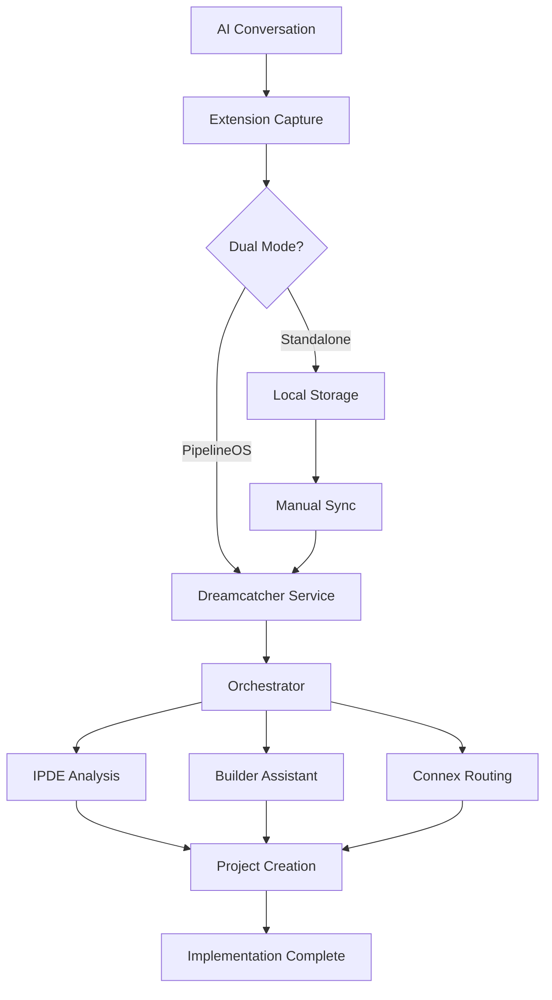
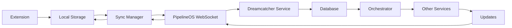

# Dreamcatcher System Design

**Version:** 2.0.0  
**Date:** December 2024  
**Status:** Implementation Planning  
**Purpose:** Define comprehensive system design for Dreamcatcher microservices architecture

---

## 🎯 **System Overview**

Dreamcatcher operates as a **baked-in microservice** within the PipelineOS ecosystem, providing AI conversation capture and organization capabilities while maintaining standalone functionality for freemium users.

---

## 🏗️ **Architecture Components**

### **1. Microservices Architecture**

```
┌─────────────────────────────────────────────────────────────┐
│                    PipelineOS Ecosystem                     │
├─────────────────────────────────────────────────────────────┤
│                                                             │
│  ┌─────────────┐  ┌─────────────┐  ┌─────────────┐         │
│  │ Orchestrator│  │ Connex      │  │ IPDE        │         │
│  │ Service     │  │ Service     │  │ Service     │         │
│  └─────────────┘  └─────────────┘  └─────────────┘         │
│                                                             │
│  ┌─────────────┐  ┌─────────────┐  ┌─────────────┐         │
│  │ Builder     │  │ Dreamcatcher│  │ Common      │         │
│  │ Assistant   │  │ Service     │  │ Utilities   │         │
│  │ Service     │  │             │  │             │         │
│  └─────────────┘  └─────────────┘  └─────────────┘         │
│                                                             │
└─────────────────────────────────────────────────────────────┘
```

### **2. Service Communication**

#### **Internal Communication**
```python
# services/common/communication.py
import httpx
import asyncio
from typing import Dict, Any

class ServiceClient:
    def __init__(self, service_url: str):
        self.service_url = service_url
        self.client = httpx.AsyncClient()

    async def call_service(self, endpoint: str, data: Dict[Any, Any]):
        """Call internal service"""
        response = await self.client.post(
            f"{self.service_url}{endpoint}",
            json=data
        )
        return response.json()

# Service clients
connex_client = ServiceClient("http://connex:8000")
ipde_client = ServiceClient("http://ipde:8000")
builder_assistant_client = ServiceClient("http://builder-assistant:8000")
dreamcatcher_client = ServiceClient("http://dreamcatcher:8000")
```

#### **Event-Driven Architecture**
```python
# services/common/events.py
import redis
import json
from typing import Dict, Any

class EventBus:
    def __init__(self, redis_url: str):
        self.redis = redis.from_url(redis_url)
        self.pubsub = self.redis.pubsub()

    async def publish_event(self, channel: str, event: Dict[Any, Any]):
        """Publish event to channel"""
        await self.redis.publish(channel, json.dumps(event))

    async def subscribe_to_events(self, channels: list, callback):
        """Subscribe to events"""
        await self.pubsub.subscribe(*channels)
        async for message in self.pubsub.listen():
            if message['type'] == 'message':
                event_data = json.loads(message['data'])
                await callback(message['channel'], event_data)

# Event bus instance
event_bus = EventBus("redis://redis:6379")
```

---

## 🔧 **Dreamcatcher Service Design**

### **1. Service Structure**

```
services/dreamcatcher/
├── app/
│   ├── main.py              # FastAPI application
│   ├── models.py            # Database models
│   ├── services/            # Business logic
│   │   ├── dream_service.py
│   │   ├── fragment_service.py
│   │   └── conversation_service.py
│   ├── clients/             # External service clients
│   │   ├── pipelineos_client.py
│   │   └── ai_client.py
│   ├── database.py          # Database configuration
│   └── config.py            # Service configuration
├── tests/                   # Test files
├── Dockerfile              # Container configuration
├── requirements.txt        # Python dependencies
└── README.md              # Service documentation
```

### **2. Database Models**

```python
# services/dreamcatcher/app/models.py
from sqlalchemy import Column, String, DateTime, JSON, Text, Boolean, Integer
from sqlalchemy.ext.declarative import declarative_base
from sqlalchemy.sql import func

Base = declarative_base()

class Dream(Base):
    __tablename__ = "dreams"
    
    id = Column(String, primary_key=True)
    title = Column(String, nullable=False)
    description = Column(Text)
    status = Column(String, default="idea")
    tags = Column(JSON)
    created = Column(DateTime, default=func.now())
    updated = Column(DateTime, default=func.now(), onupdate=func.now())
    synced_with_pipelineos = Column(Boolean, default=False)
    synced_at = Column(DateTime)
    pipelineos_project_id = Column(String)
    brand = Column(String, default="personal")
    summary = Column(Text)
    todos = Column(JSON)
    documents = Column(JSON)

class Fragment(Base):
    __tablename__ = "fragments"
    
    id = Column(String, primary_key=True)
    dream_id = Column(String, nullable=False)
    title = Column(String, nullable=False)
    content = Column(Text, nullable=False)
    source = Column(String, nullable=False)
    url = Column(String)
    date = Column(DateTime, default=func.now())
    features = Column(JSON)
    code_snippets = Column(JSON)

class Implementation(Base):
    __tablename__ = "implementations"
    
    id = Column(String, primary_key=True)
    dream_id = Column(String, nullable=False)
    status = Column(String, default="pending")
    project_id = Column(String)
    tickets_created = Column(Integer, default=0)
    agents_assigned = Column(Integer, default=0)
    estimated_completion = Column(String)
    created_at = Column(DateTime, default=func.now())
    completed_at = Column(DateTime)
```

### **3. Service Layer**

```python
# services/dreamcatcher/app/services/dream_service.py
from sqlalchemy.orm import Session
from ..models import Dream, Fragment
from ..clients import pipelineos_client

class DreamService:
    def __init__(self, db: Session):
        self.db = db

    async def import_dream(self, dream_data: dict):
        """Import dream from extension"""
        try:
            # Create dream
            dream = Dream(
                id=dream_data.get('id'),
                title=dream_data.get('title'),
                description=dream_data.get('description'),
                status=dream_data.get('status', 'idea'),
                tags=dream_data.get('tags', []),
                brand=dream_data.get('brand', 'personal'),
                summary=dream_data.get('summary'),
                todos=dream_data.get('todos', []),
                documents=dream_data.get('documents', [])
            )
            
            self.db.add(dream)
            self.db.commit()
            
            # Create fragments
            for fragment_data in dream_data.get('fragments', []):
                fragment = Fragment(
                    id=fragment_data.get('id'),
                    dream_id=dream.id,
                    title=fragment_data.get('title'),
                    content=fragment_data.get('content'),
                    source=fragment_data.get('source'),
                    url=fragment_data.get('url'),
                    features=fragment_data.get('features', []),
                    code_snippets=fragment_data.get('codeSnippets', [])
                )
                self.db.add(fragment)
            
            self.db.commit()
            
            # Send to PipelineOS orchestrator
            pipelineos_result = await pipelineos_client.create_project_from_dream(dream_data)
            
            # Update dream with PipelineOS project ID
            dream.pipelineos_project_id = pipelineos_result.get('project_id')
            dream.synced_with_pipelineos = True
            dream.synced_at = func.now()
            
            self.db.commit()
            
            return {
                "success": True,
                "dream_id": dream.id,
                "project_id": pipelineos_result.get('project_id'),
                "tickets_created": pipelineos_result.get('tickets_created', 0),
                "agents_assigned": pipelineos_result.get('agents_assigned', 0),
                "estimated_completion": pipelineos_result.get('estimated_completion')
            }
            
        except Exception as e:
            self.db.rollback()
            raise HTTPException(status_code=400, detail=str(e))

    async def implement_dream(self, dream_id: str):
        """Implement dream as project"""
        dream = self.db.query(Dream).filter(Dream.id == dream_id).first()
        if not dream:
            raise HTTPException(status_code=404, detail="Dream not found")
        
        # Implementation logic
        result = await pipelineos_client.implement_project(dream.pipelineos_project_id)
        
        # Update dream status
        dream.status = "completed"
        self.db.commit()
        
        return result

    async def get_dreams_by_brand(self, brand: str):
        """Get dreams filtered by brand"""
        dreams = self.db.query(Dream).filter(Dream.brand == brand).all()
        return dreams

    async def update_dream_todos(self, dream_id: str, todos: list):
        """Update dream todos"""
        dream = self.db.query(Dream).filter(Dream.id == dream_id).first()
        if not dream:
            raise HTTPException(status_code=404, detail="Dream not found")
        
        dream.todos = todos
        dream.updated = func.now()
        self.db.commit()
        
        return dream
```

### **4. API Endpoints**

```python
# services/dreamcatcher/app/main.py
from fastapi import FastAPI, Depends, HTTPException
from sqlalchemy.orm import Session
from .database import get_db
from .models import Dream, Fragment, Implementation
from .services import DreamService, FragmentService, ConversationService

app = FastAPI(title="Dreamcatcher Service", version="2.0.0")

@app.post("/api/v1/dreams/import")
async def import_dream(
    dream_data: dict,
    db: Session = Depends(get_db)
):
    """Import dream from extension"""
    dream_service = DreamService(db)
    result = await dream_service.import_dream(dream_data)
    return result

@app.post("/api/v1/conversations/capture")
async def capture_conversation(
    conversation_data: dict,
    db: Session = Depends(get_db)
):
    """Capture AI conversation"""
    conversation_service = ConversationService(db)
    result = await conversation_service.capture_conversation(conversation_data)
    return result

@app.get("/api/v1/dreams/{dream_id}/implement")
async def implement_dream(
    dream_id: str,
    db: Session = Depends(get_db)
):
    """Implement dream as project"""
    dream_service = DreamService(db)
    result = await dream_service.implement_dream(dream_id)
    return result

@app.get("/api/v1/dreams/brand/{brand}")
async def get_dreams_by_brand(
    brand: str,
    db: Session = Depends(get_db)
):
    """Get dreams by brand"""
    dream_service = DreamService(db)
    dreams = await dream_service.get_dreams_by_brand(brand)
    return dreams

@app.put("/api/v1/dreams/{dream_id}/todos")
async def update_dream_todos(
    dream_id: str,
    todos: list,
    db: Session = Depends(get_db)
):
    """Update dream todos"""
    dream_service = DreamService(db)
    result = await dream_service.update_dream_todos(dream_id, todos)
    return result

@app.websocket("/ws/dreamcatcher/{dream_id}")
async def websocket_endpoint(websocket: WebSocket, dream_id: str):
    """WebSocket endpoint for real-time dream updates"""
    await websocket.accept()
    # Handle real-time dream updates
    while True:
        data = await websocket.receive_text()
        # Process and broadcast dream updates
        await websocket.send_text(data)
```

---

## 🔄 **Data Flow Architecture**

### **1. Conversation-to-Implementation Workflow**



### **2. Real-Time Sync Flow**



### **3. Service Orchestration**

```python
# services/orchestrator/app/services/orchestrator.py
from ..clients import connex_client, ipde_client, builder_assistant_client, dreamcatcher_client

class ServiceOrchestrator:
    def __init__(self):
        self.clients = {
            'connex': connex_client,
            'ipde': ipde_client,
            'builder_assistant': builder_assistant_client,
            'dreamcatcher': dreamcatcher_client
        }

    async def execute_workflow(self, workflow_data: dict):
        """Execute workflow across services"""
        workflow_type = workflow_data.get('type')
        
        if workflow_type == 'conversation_to_implementation':
            return await self.conversation_to_implementation_workflow(workflow_data)
        elif workflow_type == 'legacy_modernization':
            return await self.legacy_modernization_workflow(workflow_data)
        elif workflow_type == 'code_analysis':
            return await self.code_analysis_workflow(workflow_data)
        
        raise ValueError(f"Unknown workflow type: {workflow_type}")

    async def conversation_to_implementation_workflow(self, data: dict):
        """Conversation to implementation workflow"""
        # 1. Capture conversation (Dreamcatcher)
        dream_result = await self.clients['dreamcatcher'].call_service(
            '/api/v1/conversations/capture', data
        )
        
        # 2. Analyze code (IPDE)
        analysis_result = await self.clients['ipde'].call_service(
            '/api/v1/analysis/run', dream_result
        )
        
        # 3. Generate implementation (Builder Assistant)
        implementation_result = await self.clients['builder_assistant'].call_service(
            '/api/v1/code/generate', analysis_result
        )
        
        # 4. Route updates (Connex)
        routing_result = await self.clients['connex'].call_service(
            '/api/v1/webhooks/ingest', implementation_result
        )
        
        return routing_result
```

---

## 🔐 **Security Design**

### **1. Authentication and Authorization**

```python
# services/common/auth.py
from fastapi import Depends, HTTPException, status
from fastapi.security import HTTPBearer, HTTPAuthorizationCredentials
import jwt
from datetime import datetime, timedelta

security = HTTPBearer()

class AuthService:
    def __init__(self, secret_key: str):
        self.secret_key = secret_key
        self.algorithm = "HS256"

    def create_token(self, user_id: str, expires_delta: timedelta = None):
        """Create JWT token"""
        if expires_delta:
            expire = datetime.utcnow() + expires_delta
        else:
            expire = datetime.utcnow() + timedelta(hours=24)
        
        to_encode = {"sub": user_id, "exp": expire}
        encoded_jwt = jwt.encode(to_encode, self.secret_key, algorithm=self.algorithm)
        return encoded_jwt

    def verify_token(self, token: str):
        """Verify JWT token"""
        try:
            payload = jwt.decode(token, self.secret_key, algorithms=[self.algorithm])
            user_id: str = payload.get("sub")
            if user_id is None:
                raise HTTPException(
                    status_code=status.HTTP_401_UNAUTHORIZED,
                    detail="Invalid authentication credentials",
                    headers={"WWW-Authenticate": "Bearer"},
                )
            return user_id
        except jwt.PyJWTError:
            raise HTTPException(
                status_code=status.HTTP_401_UNAUTHORIZED,
                detail="Invalid authentication credentials",
                headers={"WWW-Authenticate": "Bearer"},
            )

def get_current_user(credentials: HTTPAuthorizationCredentials = Depends(security)):
    """Get current user from token"""
    auth_service = AuthService("your-secret-key")
    user_id = auth_service.verify_token(credentials.credentials)
    return user_id
```

### **2. Data Encryption**

```python
# services/common/encryption.py
from cryptography.fernet import Fernet
import base64
import os

class EncryptionService:
    def __init__(self):
        self.key = os.getenv("ENCRYPTION_KEY", Fernet.generate_key())
        self.cipher = Fernet(self.key)

    def encrypt_data(self, data: str) -> str:
        """Encrypt sensitive data"""
        encrypted_data = self.cipher.encrypt(data.encode())
        return base64.b64encode(encrypted_data).decode()

    def decrypt_data(self, encrypted_data: str) -> str:
        """Decrypt sensitive data"""
        decoded_data = base64.b64decode(encrypted_data.encode())
        decrypted_data = self.cipher.decrypt(decoded_data)
        return decrypted_data.decode()
```

### **3. Input Validation**

```python
# services/common/validation.py
from pydantic import BaseModel, validator
import re

class DreamCreateRequest(BaseModel):
    title: str
    description: str
    tags: list
    brand: str

    @validator('title')
    def validate_title(cls, v):
        if not v or len(v.strip()) < 3:
            raise ValueError('Title must be at least 3 characters')
        return v.strip()

    @validator('tags')
    def validate_tags(cls, v):
        if not isinstance(v, list):
            raise ValueError('Tags must be a list')
        return [tag.strip() for tag in v if tag.strip()]

    @validator('brand')
    def validate_brand(cls, v):
        allowed_brands = ['personal', 'bc-innovations', 'bc-studio', 'mpgworldwide', 'accordingto']
        if v not in allowed_brands:
            raise ValueError(f'Brand must be one of: {allowed_brands}')
        return v
```

---

## 📊 **Monitoring and Observability**

### **1. Logging**

```python
# services/common/logging.py
import logging
import json
from datetime import datetime

class StructuredLogger:
    def __init__(self, service_name: str):
        self.logger = logging.getLogger(service_name)
        self.logger.setLevel(logging.INFO)
        
        handler = logging.StreamHandler()
        formatter = logging.Formatter('%(message)s')
        handler.setFormatter(formatter)
        self.logger.addHandler(handler)

    def log_event(self, level: str, message: str, **kwargs):
        """Log structured event"""
        log_data = {
            "timestamp": datetime.utcnow().isoformat(),
            "level": level,
            "message": message,
            **kwargs
        }
        
        if level == "error":
            self.logger.error(json.dumps(log_data))
        elif level == "warning":
            self.logger.warning(json.dumps(log_data))
        else:
            self.logger.info(json.dumps(log_data))
```

### **2. Metrics**

```python
# services/common/metrics.py
from prometheus_client import Counter, Histogram, Gauge
import time

# Define metrics
dream_captures_total = Counter('dreamcatcher_dream_captures_total', 'Total dreams captured')
dream_implementation_time = Histogram('dreamcatcher_implementation_time_seconds', 'Time to implement dream')
active_dreams = Gauge('dreamcatcher_active_dreams', 'Number of active dreams')

class MetricsCollector:
    def __init__(self):
        self.dream_captures = dream_captures_total
        self.implementation_time = dream_implementation_time
        self.active_dreams = active_dreams

    def record_dream_capture(self, dream_id: str, source: str):
        """Record dream capture"""
        self.dream_captures.labels(dream_id=dream_id, source=source).inc()

    def record_implementation_time(self, dream_id: str, duration: float):
        """Record implementation time"""
        self.implementation_time.labels(dream_id=dream_id).observe(duration)

    def update_active_dreams(self, count: int):
        """Update active dreams count"""
        self.active_dreams.set(count)
```

### **3. Health Checks**

```python
# services/dreamcatcher/app/health.py
from fastapi import APIRouter, Depends
from sqlalchemy.orm import Session
from .database import get_db

router = APIRouter()

@router.get("/health")
async def health_check():
    """Basic health check"""
    return {"status": "healthy", "service": "dreamcatcher"}

@router.get("/health/detailed")
async def detailed_health_check(db: Session = Depends(get_db)):
    """Detailed health check with database"""
    try:
        # Test database connection
        db.execute("SELECT 1")
        db_status = "healthy"
    except Exception as e:
        db_status = f"unhealthy: {str(e)}"
    
    return {
        "status": "healthy" if db_status == "healthy" else "unhealthy",
        "service": "dreamcatcher",
        "database": db_status,
        "timestamp": datetime.utcnow().isoformat()
    }
```

---

## 🚀 **Deployment Architecture**

### **1. Docker Configuration**

```dockerfile
# services/dreamcatcher/Dockerfile
FROM python:3.11-slim

WORKDIR /app

# Install system dependencies
RUN apt-get update && apt-get install -y \
    gcc \
    && rm -rf /var/lib/apt/lists/*

# Copy requirements and install Python dependencies
COPY requirements.txt .
RUN pip install --no-cache-dir -r requirements.txt

# Copy application code
COPY . .

# Create non-root user
RUN useradd -m -u 1000 dreamcatcher && chown -R dreamcatcher:dreamcatcher /app
USER dreamcatcher

# Expose port
EXPOSE 8000

# Health check
HEALTHCHECK --interval=30s --timeout=30s --start-period=5s --retries=3 \
    CMD curl -f http://localhost:8000/health || exit 1

# Start application
CMD ["uvicorn", "app.main:app", "--host", "0.0.0.0", "--port", "8000"]
```

### **2. Docker Compose**

```yaml
# docker-compose.yml
version: '3.8'

services:
  # Dreamcatcher Microservice
  dreamcatcher:
    build: ./services/dreamcatcher
    ports:
      - "8004:8000"
    environment:
      - DATABASE_URL=postgresql://user:pass@db:5432/pipelineos
      - REDIS_URL=redis://redis:6379
      - ENCRYPTION_KEY=${ENCRYPTION_KEY}
      - JWT_SECRET_KEY=${JWT_SECRET_KEY}
    depends_on:
      - db
      - redis
    volumes:
      - ./logs/dreamcatcher:/app/logs
    restart: unless-stopped

  # Database
  db:
    image: postgres:15
    environment:
      - POSTGRES_DB=pipelineos
      - POSTGRES_USER=user
      - POSTGRES_PASSWORD=pass
    volumes:
      - postgres_data:/var/lib/postgresql/data
    ports:
      - "5432:5432"
    restart: unless-stopped

  # Redis
  redis:
    image: redis:7-alpine
    ports:
      - "6379:6379"
    volumes:
      - redis_data:/data
    restart: unless-stopped

volumes:
  postgres_data:
  redis_data:
```

### **3. Kubernetes Deployment**

```yaml
# k8s/dreamcatcher-deployment.yaml
apiVersion: apps/v1
kind: Deployment
metadata:
  name: dreamcatcher
  labels:
    app: dreamcatcher
spec:
  replicas: 3
  selector:
    matchLabels:
      app: dreamcatcher
  template:
    metadata:
      labels:
        app: dreamcatcher
    spec:
      containers:
      - name: dreamcatcher
        image: dreamcatcher:latest
        ports:
        - containerPort: 8000
        env:
        - name: DATABASE_URL
          valueFrom:
            secretKeyRef:
              name: dreamcatcher-secrets
              key: database-url
        - name: REDIS_URL
          valueFrom:
            secretKeyRef:
              name: dreamcatcher-secrets
              key: redis-url
        livenessProbe:
          httpGet:
            path: /health
            port: 8000
          initialDelaySeconds: 30
          periodSeconds: 10
        readinessProbe:
          httpGet:
            path: /health/detailed
            port: 8000
          initialDelaySeconds: 5
          periodSeconds: 5
        resources:
          requests:
            memory: "256Mi"
            cpu: "250m"
          limits:
            memory: "512Mi"
            cpu: "500m"
```

---

## 🎯 **Performance Considerations**

### **1. Database Optimization**

```python
# services/dreamcatcher/app/database.py
from sqlalchemy import create_engine
from sqlalchemy.orm import sessionmaker
from sqlalchemy.pool import QueuePool

# Database configuration with connection pooling
engine = create_engine(
    DATABASE_URL,
    poolclass=QueuePool,
    pool_size=20,
    max_overflow=30,
    pool_pre_ping=True,
    pool_recycle=3600
)

SessionLocal = sessionmaker(autocommit=False, autoflush=False, bind=engine)
```

### **2. Caching Strategy**

```python
# services/dreamcatcher/app/cache.py
import redis
import json
from typing import Any, Optional

class CacheService:
    def __init__(self, redis_url: str):
        self.redis = redis.from_url(redis_url)
        self.default_ttl = 3600  # 1 hour

    async def get(self, key: str) -> Optional[Any]:
        """Get cached value"""
        value = self.redis.get(key)
        if value:
            return json.loads(value)
        return None

    async def set(self, key: str, value: Any, ttl: int = None) -> bool:
        """Set cached value"""
        ttl = ttl or self.default_ttl
        return self.redis.setex(key, ttl, json.dumps(value))

    async def delete(self, key: str) -> bool:
        """Delete cached value"""
        return self.redis.delete(key) > 0
```

### **3. Async Processing**

```python
# services/dreamcatcher/app/tasks.py
import asyncio
from celery import Celery
from .services import DreamService

# Celery configuration
celery_app = Celery('dreamcatcher')

@celery_app.task
async def process_dream_async(dream_id: str):
    """Process dream asynchronously"""
    # Long-running dream processing
    await asyncio.sleep(5)
    return {"status": "completed", "dream_id": dream_id}

@celery_app.task
async def sync_dream_to_pipelineos(dream_id: str):
    """Sync dream to PipelineOS asynchronously"""
    # Sync logic
    return {"status": "synced", "dream_id": dream_id}
```

---

## 🎯 **Conclusion**

The system design provides:

- **Scalable Architecture**: Microservices-based design
- **High Performance**: Optimized database and caching
- **Security**: Comprehensive security measures
- **Observability**: Monitoring and logging
- **Reliability**: Health checks and error handling
- **Maintainability**: Clean code structure and documentation

**Success depends on proper implementation, testing, and monitoring.**
