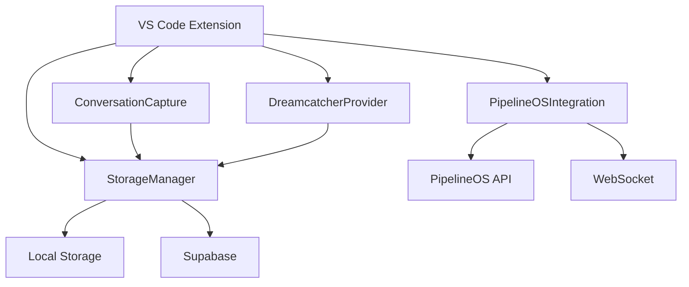

# Dreamcatcher VS Code Extension

**Version:** 2.0.0  
**Date:** December 2024  
**Status:** Development  
**Purpose:** Capture AI conversations directly in VS Code/Cursor

---

## 🎯 **Overview**

The Dreamcatcher VS Code extension brings AI conversation capture directly into your development environment. It provides seamless integration between AI conversations and project development, allowing developers to capture, organize, and implement AI-generated ideas without leaving their editor.

---

## 🚀 **Key Features**

### **Direct Editor Integration**
- **In-Editor Capture**: Capture conversations without switching applications
- **Context Menu Actions**: Right-click to create dreams from selected text
- **Status Bar Integration**: Quick access to capture functionality
- **Tree View**: Browse dreams and fragments in the sidebar
- **Keyboard Shortcuts**: Fast capture with customizable hotkeys

### **AI Conversation Capture**
- **Multi-Source Support**: ChatGPT, Claude, Copilot, and other AI tools
- **Smart Detection**: Auto-detect project names and context
- **Code Extraction**: Extract code snippets and features
- **Tag Generation**: Automatic tagging based on content
- **Summary Generation**: AI-powered dream summaries

### **PipelineOS Integration**
- **Real-Time Sync**: Bidirectional sync with PipelineOS
- **WebSocket Updates**: Live updates from PipelineOS
- **Project Creation**: Turn dreams into PipelineOS projects
- **Implementation Tracking**: Monitor dream implementation status
- **Agent Assignment**: Assign AI agents to dream implementation

---

## 🏗️ **Architecture**

### **Extension Structure**
```
extensions/vscode/
├── src/
│   ├── extension.ts              # Main extension entry point
│   ├── conversation-capture.ts   # Conversation capture logic
│   ├── dreamcatcher-provider.ts # Tree view data provider
│   ├── storage-manager.ts       # Local storage management
│   └── pipelineos-integration.ts # PipelineOS API integration
├── package.json                 # Extension manifest
├── tsconfig.json               # TypeScript configuration
└── README.md                   # Extension documentation
```

### **Component Interactions**


---

## ⚙️ **Configuration**

### **Basic Settings**
```json
{
  "dreamcatcher.enabled": true,
  "dreamcatcher.autoCapture": false,
  "dreamcatcher.storage.type": "local",
  "dreamcatcher.limits.maxDreams": 50,
  "dreamcatcher.features.autoTagging": true,
  "dreamcatcher.features.autoSummarization": true
}
```

### **PipelineOS Integration**
```json
{
  "dreamcatcher.pipelineOS.enabled": true,
  "dreamcatcher.pipelineOS.apiUrl": "https://api.pipelineos.dev",
  "dreamcatcher.pipelineOS.apiKey": "your-api-key",
  "dreamcatcher.pipelineOS.wsUrl": "wss://ws.pipelineos.dev"
}
```

### **Supabase Configuration**
```json
{
  "dreamcatcher.storage.type": "supabase",
  "dreamcatcher.supabase.url": "https://your-project.supabase.co",
  "dreamcatcher.supabase.key": "your-supabase-key"
}
```

---

## 🎮 **User Interface**

### **Tree View Structure**
```
Dreamcatcher
├── Dream 1: React Dashboard
│   ├── Fragment 1: Initial Requirements
│   │   ├── Features (3)
│   │   │   ├── User Authentication
│   │   │   ├── Data Visualization
│   │   │   └── Real-time Updates
│   │   ├── Code Snippets (2)
│   │   │   ├── React Component
│   │   │   └── API Integration
│   │   ├── Source: ChatGPT
│   │   └── Date: 12/15/2024
│   └── Fragment 2: Implementation Details
├── Dream 2: Mobile App
└── Dream 3: API Service
```

### **Status Bar Integration**
- **Dreamcatcher Icon**: Quick access to capture functionality
- **Dream Count**: Display number of local dreams
- **Sync Status**: Show PipelineOS sync status
- **Connection Status**: Display API connection status

### **Context Menu Actions**
- **Create Dream from Selection**: Capture selected text as dream
- **Add to Existing Dream**: Append content to existing dream
- **Send to PipelineOS**: Sync dream with PipelineOS
- **Open in Dashboard**: Open web dashboard

---

## 🔧 **Commands and Shortcuts**

### **Keyboard Shortcuts**
- `Ctrl+Shift+C` (Cmd+Shift+C on Mac): Capture conversation
- `Ctrl+Shift+Q` (Cmd+Shift+Q on Mac): Quick capture from clipboard
- `Ctrl+Shift+D` (Cmd+Shift+D on Mac): Create dream from selection

### **Command Palette Commands**
- `Dreamcatcher: Capture AI Conversation` - Open capture dialog
- `Dreamcatcher: Open Dashboard` - Open web dashboard
- `Dreamcatcher: Sync with PipelineOS` - Sync local dreams
- `Dreamcatcher: Create Dream from Selection` - Capture selected text
- `Dreamcatcher: Quick Capture` - Capture from clipboard

### **Context Menu Commands**
- `Create Dream from Selection` - Available when text is selected
- `Add to Existing Dream` - Available when text is selected
- `Send to PipelineOS` - Available on dream items
- `Open in Dashboard` - Available on dream items

---

## 🔌 **API Integration**

### **PipelineOS API Endpoints**
```typescript
interface PipelineOSAPI {
  // Dream management
  importDream(dream: Dream): Promise<ImportResult>;
  getDreamStatus(dreamId: string): Promise<DreamStatus>;
  implementDream(dreamId: string): Promise<ImplementationResult>;
  
  // Project management
  createProject(dreamId: string): Promise<Project>;
  getProjectStatus(projectId: string): Promise<ProjectStatus>;
  
  // Health check
  healthCheck(): Promise<boolean>;
}
```

### **WebSocket Events**
```typescript
interface WebSocketEvents {
  'dream_updated': { dream: Dream };
  'dream_deleted': { dreamId: string };
  'project_created': { dreamId: string; project: Project };
  'implementation_completed': { dreamId: string; result: any };
  'agent_assigned': { dreamId: string; agent: Agent };
  'status_changed': { dreamId: string; status: string };
}
```

---

## 📊 **Data Management**

### **Local Storage**
- **Extension Global State**: Store dreams in VS Code global state
- **Workspace Settings**: Store workspace-specific configuration
- **User Settings**: Store user-specific preferences
- **Backup/Restore**: Export and import dream data

### **Cloud Sync (Optional)**
- **Supabase Integration**: Optional cloud synchronization
- **Real-time Updates**: Live updates across devices
- **Conflict Resolution**: Handle sync conflicts
- **Offline Support**: Work offline with local storage

### **Data Migration**
- **Local to Cloud**: Migrate from local to Supabase
- **Cloud to Local**: Export from cloud to local
- **Cross-Device**: Sync across multiple devices
- **Backup/Restore**: Full data backup and restore

---

## 🎯 **Use Cases**

### **AI Conversation Capture**
1. **Copy AI Conversation**: Copy from ChatGPT, Claude, or other AI tools
2. **Quick Capture**: Use `Ctrl+Shift+C` to open capture dialog
3. **Enter Details**: Add project name, description, and tags
4. **Create Dream**: Dream is created and visible in tree view
5. **Sync to PipelineOS**: Send dream to PipelineOS for implementation

### **Code Selection Capture**
1. **Select Code**: Select code or text in editor
2. **Context Menu**: Right-click → "Create Dream from Selection"
3. **Quick Creation**: Dream is created with selected content
4. **Add Details**: Add description and tags
5. **Track Progress**: Monitor dream implementation

### **PipelineOS Workflow**
1. **Configure API**: Set up PipelineOS API credentials
2. **Capture Dreams**: Create dreams in VS Code
3. **Sync Dreams**: Use "Sync with PipelineOS" command
4. **Monitor Status**: Track implementation progress
5. **Receive Updates**: Get real-time updates via WebSocket

---

## 🔧 **Development**

### **Prerequisites**
- Node.js 16+
- TypeScript 4.9+
- VS Code Extension Development Tools
- Git

### **Setup**
```bash
# Clone repository
git clone https://github.com/dreamcatcher/dreamcatcher.git
cd dreamcatcher/extensions/vscode

# Install dependencies
npm install

# Compile TypeScript
npm run compile

# Run in development
F5 # Start debugging in VS Code
```

### **Build Commands**
```bash
npm run compile    # Compile TypeScript
npm run watch      # Watch mode for development
npm run lint       # Lint code with ESLint
npm run test       # Run tests
npm run package    # Package extension for distribution
```

### **Testing**
```bash
# Run extension in development
F5 # Start debugging in VS Code

# Run tests
npm test

# Lint code
npm run lint
```

---

## 📈 **Roadmap**

### **Phase 1: Core Features (v2.0.0)**
- [x] Basic conversation capture
- [x] Tree view for dreams
- [x] Local storage
- [x] Keyboard shortcuts
- [x] Context menu actions

### **Phase 2: PipelineOS Integration (v2.1.0)**
- [ ] PipelineOS API integration
- [ ] WebSocket real-time updates
- [ ] Project creation from dreams
- [ ] Implementation status tracking
- [ ] Agent assignment

### **Phase 3: Advanced Features (v2.2.0)**
- [ ] Supabase cloud sync
- [ ] Team collaboration
- [ ] Advanced search and filtering
- [ ] Custom themes and branding
- [ ] Plugin system

### **Phase 4: Platform Expansion (v2.3.0)**
- [ ] Cursor-specific features
- [ ] JetBrains IDE support
- [ ] Sublime Text support
- [ ] Vim/Neovim support
- [ ] Cross-platform compatibility

---

## 🔒 **Security**

### **Data Protection**
- **Local Storage**: Data stored locally in VS Code
- **Encryption**: Sensitive data encrypted at rest
- **API Keys**: Secure storage of API credentials
- **Permissions**: Minimal required permissions

### **Privacy**
- **No Telemetry**: No user data collection
- **Local First**: Data stays local by default
- **Opt-in Sync**: Cloud sync is optional
- **User Control**: Full control over data

---

## 🤝 **Contributing**

### **Development Guidelines**
- TypeScript with strict mode
- ESLint configuration
- Prettier formatting
- Conventional commits
- Unit tests for new features

### **Pull Request Process**
1. Fork the repository
2. Create feature branch
3. Make changes with tests
4. Submit pull request
5. Code review and merge

---

## 📄 **License**

MIT License - see LICENSE file for details

---

## 🔗 **Related Documentation**

- [Dreamcatcher Main Project](../README.md)
- [PipelineOS Integration](../strategic/PIPELINEOS_INTEGRATION_STRATEGY.md)
- [Browser Extension](../extensions/BROWSER_EXTENSION.md)
- [API Documentation](../api/API_REFERENCE.md)
