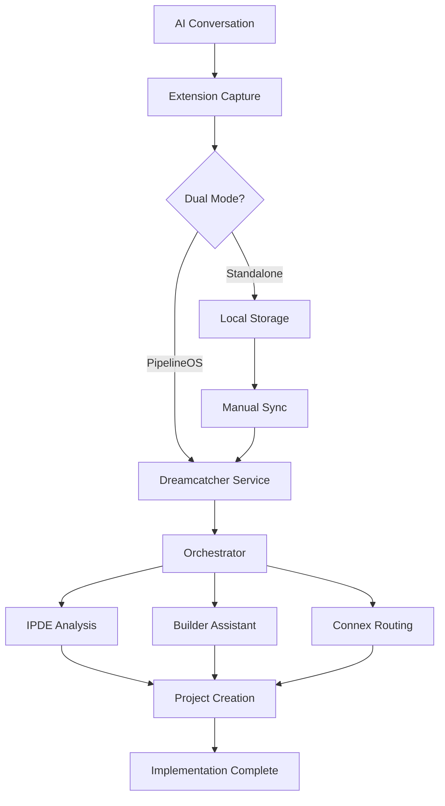
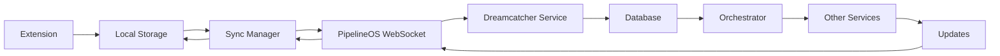

# PipelineOS Integration Strategy

**Version:** 2.0.0  
**Date:** December 2024  
**Status:** Implementation Planning  
**Purpose:** Define comprehensive strategy for Dreamcatcher integration with PipelineOS

---

## 🎯 **Strategic Overview**

Dreamcatcher is transitioning from a standalone application to a **baked-in microservice** within the PipelineOS ecosystem, while maintaining standalone capabilities for freemium users.

---

## 🏗️ **Integration Architecture**

### **Dual-Track Strategy**

#### **Track 1: PipelineOS Integration (Primary)**
- **Baked-in microservice** within PipelineOS
- **Native integration** with orchestrator
- **Shared infrastructure** (database, Redis, auth)
- **Real-time communication** via WebSockets
- **Unified development** and deployment

#### **Track 2: Standalone Freemium (Secondary)**
- **Independent application** for personal use
- **Local storage** with optional cloud sync
- **Simplified feature set** for individual users
- **Freemium pricing** model
- **API-based integration** with PipelineOS

---

## 🔧 **Technical Implementation**

### **1. Microservice Architecture**

#### **Dreamcatcher Service**
```python
# services/dreamcatcher/app/main.py
from fastapi import FastAPI, Depends, HTTPException
from sqlalchemy.orm import Session
from .database import get_db
from .models import Dream, Fragment, Implementation
from .services import DreamService, FragmentService, ConversationService

app = FastAPI(title="Dreamcatcher Service", version="2.0.0")

@app.post("/api/v1/dreams/import")
async def import_dream(
    dream_data: dict,
    db: Session = Depends(get_db)
):
    """Import dream from extension"""
    dream_service = DreamService(db)
    result = await dream_service.import_dream(dream_data)
    return result

@app.post("/api/v1/conversations/capture")
async def capture_conversation(
    conversation_data: dict,
    db: Session = Depends(get_db)
):
    """Capture AI conversation"""
    conversation_service = ConversationService(db)
    result = await conversation_service.capture_conversation(conversation_data)
    return result

@app.get("/api/v1/dreams/{dream_id}/implement")
async def implement_dream(
    dream_id: str,
    db: Session = Depends(get_db)
):
    """Implement dream as project"""
    dream_service = DreamService(db)
    result = await dream_service.implement_dream(dream_id)
    return result

@app.websocket("/ws/dreamcatcher/{dream_id}")
async def websocket_endpoint(websocket: WebSocket, dream_id: str):
    """WebSocket endpoint for real-time dream updates"""
    await websocket.accept()
    # Handle real-time dream updates
    while True:
        data = await websocket.receive_text()
        # Process and broadcast dream updates
        await websocket.send_text(data)
```

#### **Service Orchestration**
```python
# services/orchestrator/app/services/orchestrator.py
from ..clients import connex_client, ipde_client, builder_assistant_client, dreamcatcher_client

class ServiceOrchestrator:
    def __init__(self):
        self.clients = {
            'connex': connex_client,
            'ipde': ipde_client,
            'builder_assistant': builder_assistant_client,
            'dreamcatcher': dreamcatcher_client
        }

    async def execute_workflow(self, workflow_data: dict):
        """Execute workflow across services"""
        workflow_type = workflow_data.get('type')
        
        if workflow_type == 'conversation_to_implementation':
            return await self.conversation_to_implementation_workflow(workflow_data)
        elif workflow_type == 'legacy_modernization':
            return await self.legacy_modernization_workflow(workflow_data)
        elif workflow_type == 'code_analysis':
            return await self.code_analysis_workflow(workflow_data)
        
        raise ValueError(f"Unknown workflow type: {workflow_type}")

    async def conversation_to_implementation_workflow(self, data: dict):
        """Conversation to implementation workflow"""
        # 1. Capture conversation (Dreamcatcher)
        dream_result = await self.clients['dreamcatcher'].call_service(
            '/api/v1/conversations/capture', data
        )
        
        # 2. Analyze code (IPDE)
        analysis_result = await self.clients['ipde'].call_service(
            '/api/v1/analysis/run', dream_result
        )
        
        # 3. Generate implementation (Builder Assistant)
        implementation_result = await self.clients['builder_assistant'].call_service(
            '/api/v1/code/generate', analysis_result
        )
        
        # 4. Route updates (Connex)
        routing_result = await self.clients['connex'].call_service(
            '/api/v1/webhooks/ingest', implementation_result
        )
        
        return routing_result
```

### **2. Extension Integration**

#### **Dual-Mode Operation**
```javascript
// apps/extension/content.js
class PipelineOSIntegration {
  constructor() {
    this.pipelineOSConfig = null;
    this.api = null;
    this.initialize();
  }

  async initialize() {
    try {
      const result = await chrome.storage.local.get(['pipelineOSConfig']);
      this.pipelineOSConfig = result.pipelineOSConfig;
      
      if (this.pipelineOSConfig && this.pipelineOSConfig.enabled) {
        console.log('🔗 PipelineOS integration enabled');
        this.api = new DreamcatcherAPI(this.pipelineOSConfig);
        this.updateUIForPipelineOS();
      } else {
        console.log('📝 Standalone Dreamcatcher mode');
        this.updateUIForStandalone();
      }
    } catch (error) {
      console.error('Failed to initialize PipelineOS:', error);
    }
  }

  async captureAndSend(dreamData) {
    if (this.pipelineOSConfig && this.pipelineOSConfig.enabled) {
      // Send directly to PipelineOS
      const result = await this.api.captureConversation(dreamData);
      this.showNotification('✅ Sent to PipelineOS!', 'success');
      return result;
    } else {
      // Local capture (standalone mode)
      await chrome.runtime.sendMessage({
        action: 'capture',
        data: dreamData
      });
      this.showNotification('✅ Dream captured!', 'success');
    }
  }
}
```

#### **Real-Time Sync**
```javascript
// packages/shared/src/sync-manager.js
class PipelineOSSyncManager {
  constructor() {
    this.syncInterval = null;
    this.isOnline = navigator.onLine;
    this.pendingSyncs = [];
    this.pipelineOSWebSocket = null;
  }

  async initializeSync() {
    const config = await this.getPipelineOSConfig();
    if (!config || !config.enabled) {
      console.log('PipelineOS sync disabled');
      return;
    }

    this.startPeriodicSync();
    this.connectToPipelineOS(config);
    
    // Listen for online/offline events
    window.addEventListener('online', () => this.handleOnline());
    window.addEventListener('offline', () => this.handleOffline());
    
    // Listen for storage changes
    chrome.storage.onChanged.addListener((changes) => {
      if (changes.dreams) {
        this.queueSync();
      }
    });
  }

  async performSync() {
    if (!this.isOnline) {
      console.log('Offline - queuing sync');
      return;
    }

    try {
      const dreams = await this.getLocalDreams();
      const unsyncedDreams = dreams.filter(dream => !dream.syncedWithPipelineOS);
      
      if (unsyncedDreams.length === 0) {
        console.log('All dreams synced');
        return;
      }

      console.log(`Syncing ${unsyncedDreams.length} dreams to PipelineOS`);
      
      for (const dream of unsyncedDreams) {
        await this.syncDream(dream);
      }
      
      console.log('Sync completed successfully');
    } catch (error) {
      console.error('Sync failed:', error);
      this.queueSync();
    }
  }

  connectToPipelineOS(config) {
    const wsUrl = `${config.wsUrl}/ws/dreamcatcher/${config.apiKey}`;
    
    this.pipelineOSWebSocket = new WebSocket(wsUrl);
    
    this.pipelineOSWebSocket.onopen = () => {
      console.log('Connected to PipelineOS WebSocket');
      this.isConnected = true;
      this.processSyncQueue();
    };
    
    this.pipelineOSWebSocket.onmessage = (event) => {
      const message = JSON.parse(event.data);
      this.handlePipelineOSMessage(message);
    };
    
    this.pipelineOSWebSocket.onclose = () => {
      console.log('Disconnected from PipelineOS WebSocket');
      this.isConnected = false;
      // Reconnect after 5 seconds
      setTimeout(() => this.connectToPipelineOS(config), 5000);
    };
  }

  async handlePipelineOSMessage(message) {
    switch (message.type) {
      case 'dream_updated':
        await this.updateLocalDream(message.dream);
        break;
      case 'dream_deleted':
        await this.deleteLocalDream(message.dreamId);
        break;
      case 'project_created':
        await this.updateDreamWithProject(message.dreamId, message.project);
        break;
      case 'implementation_completed':
        await this.updateDreamImplementation(message.dreamId, message.result);
        break;
    }
  }
}
```

---

## 📊 **Data Flow Architecture**

### **Conversation-to-Implementation Workflow**



### **Real-Time Sync Flow**



---

## 🔄 **Migration Strategy**

### **Phase 1: Service Extraction (Week 1)**

#### **1.1 Create Microservice Structure**
```bash
# Create microservice directories
mkdir -p pipelineos/services/dreamcatcher
mkdir -p pipelineos/apps/dreamcatcher
mkdir -p pipelineos/extensions/dreamcatcher

# Move existing implementation
cp dreamcatcher/src/* pipelineos/apps/dreamcatcher/
cp dreamcatcher-extension/* pipelineos/extensions/dreamcatcher/
```

#### **1.2 Extract Service Logic**
```python
# services/dreamcatcher/app/main.py
# Extract from orchestrator MVP implementation
# Create dedicated service endpoints
# Implement WebSocket support
```

### **Phase 2: Extension Updates (Week 2)**

#### **2.1 Update Extension Configuration**
```json
// extensions/dreamcatcher/manifest.json
{
  "manifest_version": 3,
  "name": "PipelineOS Capture",
  "version": "2.0.0",
  "description": "Capture AI conversations for PipelineOS implementation",
  "permissions": [
    "storage",
    "activeTab",
    "scripting",
    "background"
  ],
  "host_permissions": [
    "https://chat.openai.com/*",
    "https://claude.ai/*",
    "https://*.pipelineos.dev/*"
  ],
  "action": {
    "default_popup": "popup.html",
    "default_icon": {
      "16": "icons/icon16.png",
      "48": "icons/icon48.png",
      "128": "icons/icon128.png"
    }
  },
  "background": {
    "service_worker": "background.js"
  },
  "content_scripts": [
    {
      "matches": [
        "https://chat.openai.com/*",
        "https://claude.ai/*"
      ],
      "js": ["content.js"],
      "css": ["content.css"]
    }
  ],
  "icons": {
    "16": "icons/icon16.png",
    "48": "icons/icon48.png",
    "128": "icons/icon128.png"
  }
}
```

#### **2.2 Implement Dual-Mode Operation**
```javascript
// extensions/dreamcatcher/content.js
// Add PipelineOS configuration
// Implement dual-mode capture logic
// Add real-time sync capabilities
```

### **Phase 3: Integration Testing (Week 3)**

#### **3.1 End-to-End Testing**
- **Extension Capture**: Test both modes
- **Service Communication**: Test API calls
- **Real-Time Sync**: Test WebSocket communication
- **Error Handling**: Test failure scenarios

#### **3.2 Performance Testing**
- **Load Testing**: Multiple concurrent captures
- **Sync Performance**: Large data sets
- **WebSocket Performance**: Real-time updates
- **Memory Usage**: Extension resource consumption

---

## 🎯 **Business Model Integration**

### **PipelineOS Integration Benefits**

#### **For Users**
- **Seamless Workflow**: Conversation to implementation
- **Real-Time Updates**: Live progress tracking
- **Unified Interface**: Single dashboard
- **Advanced Features**: AI agents, automation

#### **For PipelineOS**
- **Unique Differentiation**: Conversation-to-implementation
- **User Acquisition**: Extension-driven growth
- **Data Insights**: Conversation patterns
- **Revenue Growth**: Premium features

### **Standalone Freemium Benefits**

#### **For Individual Users**
- **Free Tier**: Basic capture and organization
- **Local Storage**: Privacy and control
- **Simple Interface**: Easy to use
- **Optional Sync**: Upgrade path to PipelineOS

#### **For Business**
- **Market Expansion**: Broader user base
- **Lead Generation**: Freemium to premium conversion
- **Brand Awareness**: Extension visibility
- **Revenue Diversification**: Multiple revenue streams

---

## 📈 **Success Metrics**

### **Technical Metrics**
- **Sync Success Rate**: >99% successful syncs
- **Response Time**: <500ms API responses
- **WebSocket Uptime**: >99.9% connection stability
- **Error Rate**: <1% failed operations

### **Business Metrics**
- **User Adoption**: Extension installs and usage
- **Conversion Rate**: Freemium to premium
- **Retention Rate**: Monthly active users
- **Revenue Growth**: PipelineOS subscription growth

### **User Experience Metrics**
- **Capture Success**: Successful conversation captures
- **Sync Satisfaction**: User satisfaction with sync
- **Feature Usage**: Most used features
- **Support Tickets**: Reduced support requests

---

## 🔐 **Security and Compliance**

### **Data Security**
- **Encryption**: All data encrypted in transit and at rest
- **Authentication**: JWT tokens and API keys
- **Authorization**: Role-based access control
- **Audit Logging**: Complete operation audit trail

### **Privacy Compliance**
- **Data Minimization**: Only necessary data collected
- **User Control**: Data export and deletion
- **Transparency**: Clear privacy policy
- **Consent**: Explicit user consent for data use

### **API Security**
- **Rate Limiting**: Prevent abuse and DoS
- **Input Validation**: Sanitize all inputs
- **SQL Injection**: Parameterized queries
- **XSS Protection**: Output encoding

---

## 🎯 **Implementation Timeline**

### **Week 1: Service Extraction**
- [ ] Create Dreamcatcher microservice
- [ ] Extract database models
- [ ] Implement service endpoints
- [ ] Add WebSocket support

### **Week 2: Extension Updates**
- [ ] Update extension configuration
- [ ] Implement dual-mode operation
- [ ] Add real-time sync
- [ ] Create configuration UI

### **Week 3: Integration Testing**
- [ ] End-to-end testing
- [ ] Performance testing
- [ ] Error handling testing
- [ ] Documentation updates

### **Week 4: Deployment**
- [ ] Production deployment
- [ ] Monitoring setup
- [ ] User training
- [ ] Support documentation

---

## 🎯 **Conclusion**

The PipelineOS integration strategy provides:

- **Native Integration**: Seamless workflow from conversation to implementation
- **Dual Revenue Streams**: PipelineOS subscriptions and freemium conversions
- **Market Differentiation**: Unique conversation-to-implementation capability
- **Scalable Architecture**: Microservices-based design
- **User Value**: Real-time updates and advanced features

**Success depends on proper implementation, testing, and user adoption.**